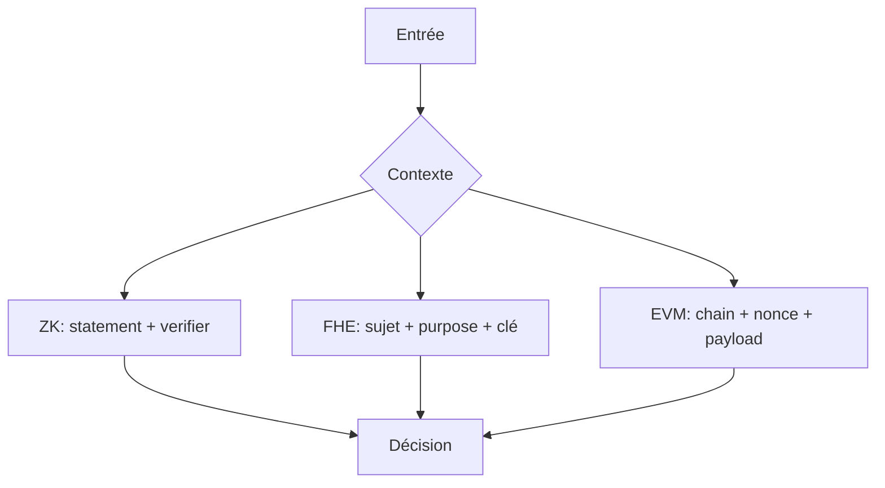

# Modèle de menaces

- Base : séquenceur indisponible, données L1 indisponibles, dérivation incohérente, clés admin compromises.
- HyperEVM : rejeu cross-chain, nonce réutilisé, signature expirée, mauvais domaine.
- ZK : statement différent, verifier non reconnu, preuve mal liée au contexte.
- FHE : autorisation trop large, clé révoquée, fuite de métadonnées.

